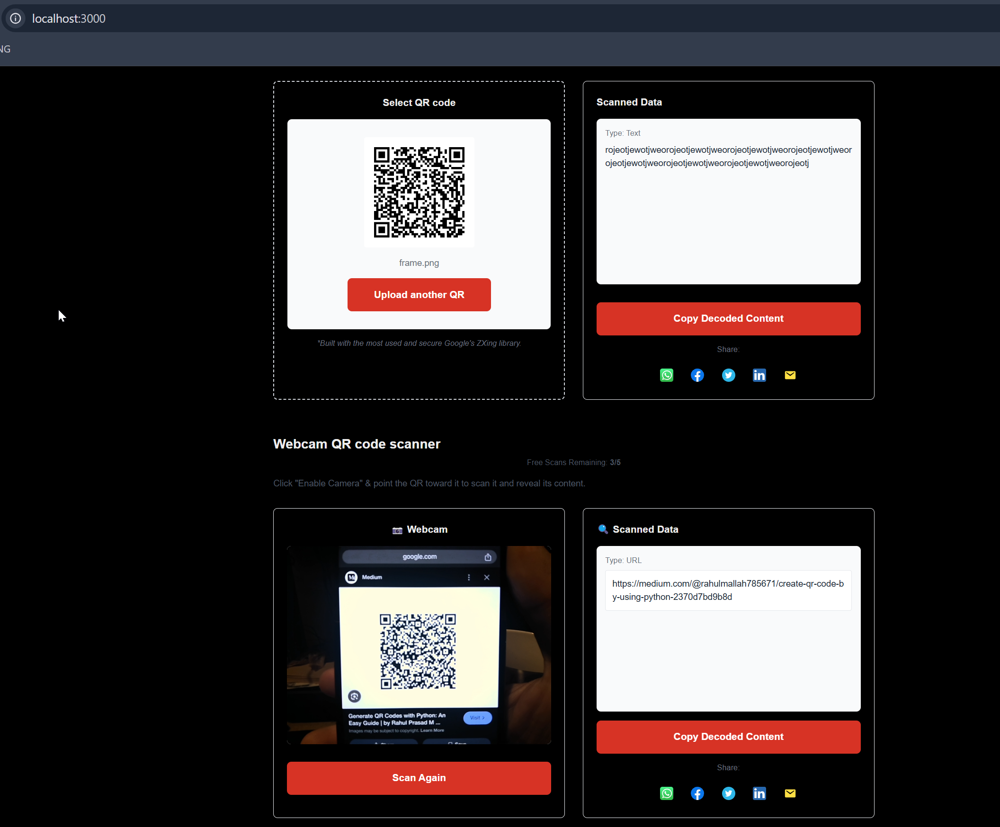

# QRdecode.AI 🔍

A modern, open-source QR code scanning and management application built with Next.js, Express, and TypeScript. Perfect for developers who want to learn full-stack development or need a starting point for their own QR code projects.

<div align="center">
  
</div>

[](LICENSE)
[](docker-compose.yml)
[](tsconfig.json)

## ✨ Features

### Core Features
- 📱 Scan QR codes using your device camera
- 📤 Upload QR code images for scanning
- 📊 View scan history and statistics
- 🔒 User authentication and authorization
- ⚡ Rate limiting to prevent abuse
- 📱 Responsive design for all devices

### Technical Features
- 🔄 Real-time updates using React
- 🎨 Modern UI with Tailwind CSS
- 🚀 Server-side rendering with Next.js
- 🔍 TypeScript for better code quality
- 📝 Comprehensive API documentation
- ✅ Extensive test coverage

## 🚀 Quick Start with Docker

The easiest way to get started is using Docker. Make sure you have [Docker](https://docs.docker.com/get-docker/) and [Docker Compose](https://docs.docker.com/compose/install/) installed.

### 1. Clone the Repository
```bash
git clone https://github.com/msdevsec/qrdecode.ai.git
cd qrdecode.ai
```

### 2. Set Up Environment Variables
```bash
# Copy environment files
cp .env.example .env
cp frontend/.env.example frontend/.env.local
cp backend/.env.example backend/.env
```

### 3. Start the Application
```bash
# Build and start all services
docker-compose up -d

# The following services will be available:
# - Frontend: http://localhost:3000
# - Backend API: http://localhost:4000
# - API Documentation: http://localhost:4000/api-docs
```

That's it! The application should now be running. 🎉

### Docker Commands Quick Reference

```bash
# Start all services
docker-compose up -d

# Stop all services
docker-compose down

# View logs
docker-compose logs -f

# Rebuild services
docker-compose up -d --build

# Remove all containers and volumes
docker-compose down -v
```

## 🛠️ Manual Setup (Without Docker)

If you prefer to run the services directly on your machine:

### Prerequisites
- Node.js 18+
- PostgreSQL 15+
- Redis 7+

### Backend Setup
```bash
cd backend
npm install
npm run prisma:migrate
npm run dev
```

### Frontend Setup
```bash
cd frontend
npm install
npm run dev
```

## 📁 Project Structure

```
.
├── frontend/                 # Next.js frontend application
│   ├── app/                 # App router pages
│   ├── components/          # React components
│   ├── context/            # React context providers
│   └── public/             # Static assets
│
├── backend/                 # Express.js backend application
│   ├── src/                # Source code
│   │   ├── controllers/    # Route controllers
│   │   ├── middleware/     # Express middleware
│   │   ├── routes/         # API routes
│   │   └── utils/          # Utility functions
│   └── prisma/             # Database schema and migrations
│
└── docker/                 # Docker configuration files
```

## 🔧 Configuration

### Environment Variables

#### Backend (.env)
- `PORT`: API server port (default: 4000)
- `DATABASE_URL`: PostgreSQL connection string
- `REDIS_URL`: Redis connection string
- `JWT_SECRET`: Secret for JWT tokens
- `RATE_LIMIT_MAX_REQUESTS`: Max requests per window (default: 5)

#### Frontend (.env.local)
- `NEXT_PUBLIC_API_URL`: Backend API URL
- `NEXT_PUBLIC_APP_NAME`: Application name
- `NEXT_PUBLIC_FREE_TIER_LIMIT`: Free tier scan limit

## 🧪 Testing

We use Jest for testing. All tests are in the `__test__` directories.

```bash
# Run backend tests
cd backend
npm test

# Run frontend tests
cd frontend
npm test
```

## 📚 API Documentation

API documentation is available at `http://localhost:4000/api-docs` when running the development server. It includes:
- All available endpoints
- Request/response schemas
- Authentication requirements
- Error codes and messages

## 🔒 Security Features

- JWT authentication
- Rate limiting
- Input validation
- CORS protection
- Error sanitization
- TypeScript type safety

## 🤝 Contributing

1. Fork the repository
2. Create your feature branch (`git checkout -b feature/AmazingFeature`)
3. Commit your changes (`git commit -m 'Add some AmazingFeature'`)
4. Push to the branch (`git push origin feature/AmazingFeature`)
5. Open a Pull Request

## 📝 License

This project is licensed under the MIT License - see the [LICENSE](LICENSE) file for details.

## 🙏 Acknowledgments

- QR code scanning powered by jsQR
- UI components inspired by Tailwind UI
- Icons from Heroicons

## 🤔 Common Issues & Solutions

### Docker Issues

1. **Ports already in use**
   ```bash
   # Check what's using the port
   netstat -ano | findstr :3000
   netstat -ano | findstr :4000
   ```

2. **Database connection issues**
   ```bash
   # Restart the database container
   docker-compose restart postgres
   ```

3. **Redis connection issues**
   ```bash
   # Check Redis logs
   docker-compose logs redis
   ```

### Development Issues

1. **TypeScript errors**
   ```bash
   # Rebuild TypeScript
   npm run clean
   npm run build
   ```

2. **Prisma issues**
   ```bash
   # Reset database and migrations
   npx prisma migrate reset
   npx prisma generate
   ```

## 📫 Support

- Create an issue for bug reports
- Star the repository if you find it useful
- Fork it if you want to contribute

---
Built with ❤️ by [msdevsec](https://github.com/msdevsec)
